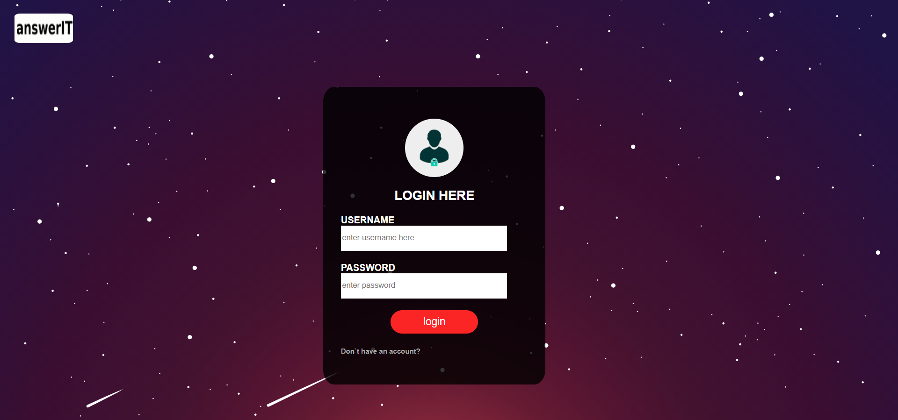
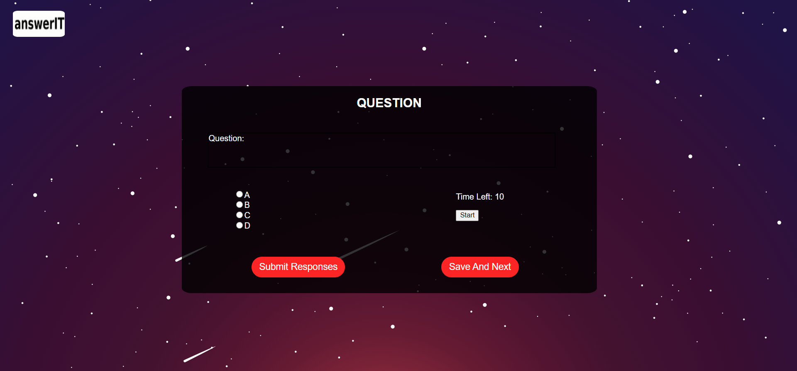

<h1 align ="center">answerIT</h1>

Worried about classes and tests in COVID ?
Dont worry ,we have got your back. Experience smarter and efficient quizing experience with answerIT. With timers for individual questions and systematic question arrangement, answerIT helps in conducting cheat-proof tests.

## Why We Built This
Observing the current online examination scenarios prevailing due to this corona pandemic it came to us that there should be a more systematic and transparent platform where colleges can conduct a more cheating-free enviroment for students. Being a student, we are very well aware of all the tricks and methods taken by students to cheat in online exams and we have tried to eliminate all their tricks by adopting the following methods

## 1. Time Limit
We have given the creator the option for setting a perfect time limit for the student to attempt a respective question in which he/she will be able to attempt the question for himself only and there will be no time left for him to help his batchmates. Also on completion of the given time limit it will automatically switch to the next question

## 2. No turning back
Once a student attempts a question and goes to the next question he/she cannot return to the previously attempted questions. In this manner the student can view a question only once

## 3. Questions will be shuffled
If you think that you can still cheat than SORRY but we know all your tricks man ! The sequence of questions will be jumbled for everyone and even the options will be jumbled so even if you form a team for cheating than your plan work ain't working this time

## Working
There will be seperate login page for the admin where the quiz will be created. Questions and their options with correct answers will be inputted by the admin, then this quiz can be shared with the students. When the students open the quiz the opeing question will be different for different studnets as well as there will a timer of very short duration which will be just enough for the students to solve the questions by themselves and hence there will be no time left for them to discuss them among thmeselves. The students cannot even save a question for doing later as there will be no going back option. Hence, if a student helps another student in a question he would have to leave his own current question. We tried to minimize cheating through all these methods. Hope you like our effort.....

## Demo

 

 
 

 

## Technology Stack
1. HTML
2. CSS
3. JavaScript
4. Node.js
5. MongoDB

## Challenges Faced
1. Major Challenge was to get the user to input to input the questions and shuffle them for students

2. Another challenge was to access the database for the inputted questions

## Limitations
Due to a lot of challenges and time limitations we were not able to fetch the question format details and were not able to work on the closing of quiz when the student tries to switch tabs on browser or even tries to minimize the window...

## Contributors:

* [Saral Srivastava](http://www.github.com/its-Easy)
* [Aditya Srivastava](http://www.github.com/adityaa22)
* [Jatin Vishal Mishra](https://github.com/jatinmishra517)
* [Khaliq Hussain](https://github.com/Khaliq-786)
  
